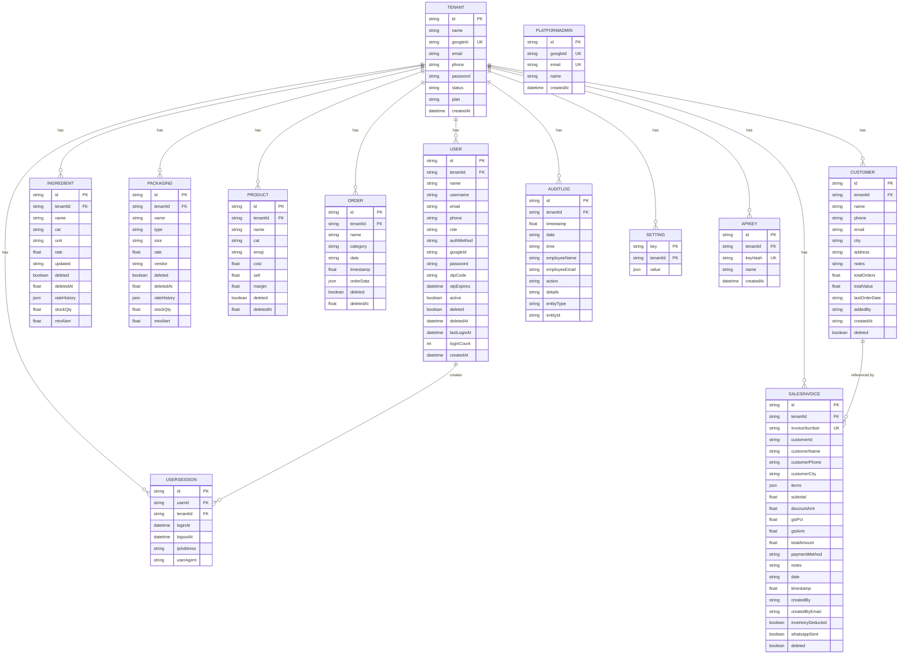

# BakeFlow ERP — Entity Relationship (ER) Diagram

## Overview

BakeFlow's database has **13 models** (tables) in PostgreSQL, managed via Prisma ORM. Every business table has a `tenantId` foreign key to `Tenant` for complete multi-tenant data isolation.

## Visual ER Diagram
 


---

## ER Diagram (Text Representation)

```
╔══════════════════╗
║     Tenant       ║ ← Root of all multi-tenant data
╠══════════════════╣
║ id (PK, UUID)    ║
║ name             ║
║ googleId (UQ)    ║
║ email            ║
║ phone            ║
║ password         ║   (temporary, during onboarding)
║ status           ║   active | suspended | pending
║ plan             ║   free | starter | pro
║ createdAt        ║
╚══════════════════╝
        │
        │ 1 ──────────────────────────────────────────── N
        │
        ├─────────────────► ╔══════════════════════╗
        │                   ║        User           ║
        │                   ╠══════════════════════╣
        │                   ║ id (PK, UUID)         ║
        │                   ║ tenantId (FK)         ║
        │                   ║ name                  ║
        │                   ║ username (UQ/tenantId)║
        │                   ║ email                 ║
        │                   ║ phone                 ║
        │                   ║ role                  ║   owner|admin|employee
        │                   ║ authMethod            ║   google | password
        │                   ║ googleId              ║
        │                   ║ password              ║   bcrypt-hashed
        │                   ║ otpCode               ║   6-digit WhatsApp OTP
        │                   ║ otpExpires            ║
        │                   ║ active                ║
        │                   ║ deleted               ║
        │                   ║ deletedAt             ║
        │                   ║ lastLoginAt           ║
        │                   ║ loginCount            ║
        │                   ║ createdAt             ║
        │                   ╚══════════════════════╝
        │                           │
        │                           │ 1:N
        │                           ▼
        │                   ╔══════════════════════╗
        │                   ║    UserSession        ║
        │                   ╠══════════════════════╣
        │                   ║ id (PK, UUID)         ║
        │                   ║ userId (FK)           ║
        │                   ║ tenantId (FK)         ║
        │                   ║ loginAt               ║
        │                   ║ logoutAt              ║
        │                   ║ ipAddress             ║
        │                   ║ userAgent             ║
        │                   ╚══════════════════════╝
        │
        ├─────────────────► ╔══════════════════════╗
        │                   ║    Ingredient         ║
        │                   ╠══════════════════════╣
        │                   ║ id (PK, UUID)         ║
        │                   ║ tenantId (FK)         ║
        │                   ║ name                  ║
        │                   ║ cat                   ║   Dry|Dairy|Chocolate|Fruit|etc
        │                   ║ unit                  ║   kg|g|litre|ml|piece|etc
        │                   ║ rate                  ║   current price per unit
        │                   ║ updated               ║
        │                   ║ deleted               ║
        │                   ║ deletedAt             ║
        │                   ║ rateHistory           ║   JSON array of {date,oldRate,newRate}
        │                   ║ stockQty              ║
        │                   ║ minAlert              ║   low-stock threshold
        │                   ╚══════════════════════╝
        │
        ├─────────────────► ╔══════════════════════╗
        │                   ║     Packaging         ║
        │                   ╠══════════════════════╣
        │                   ║ id (PK, UUID)         ║
        │                   ║ tenantId (FK)         ║
        │                   ║ name                  ║
        │                   ║ type                  ║   Box|Board|Bag|Sticker|Card|etc
        │                   ║ size                  ║
        │                   ║ rate                  ║
        │                   ║ vendor                ║
        │                   ║ deleted               ║
        │                   ║ deletedAt             ║
        │                   ║ rateHistory           ║   JSON array
        │                   ║ stockQty              ║
        │                   ║ minAlert              ║
        │                   ╚══════════════════════╝
        │
        ├─────────────────► ╔══════════════════════╗
        │                   ║      Product          ║
        │                   ╠══════════════════════╣
        │                   ║ id (PK, UUID)         ║
        │                   ║ tenantId (FK)         ║
        │                   ║ name                  ║
        │                   ║ cat                   ║   Fusion Cake|Brownie Box|etc
        │                   ║ emoji                 ║
        │                   ║ cost                  ║   calculated cost price
        │                   ║ sell                  ║   selling price
        │                   ║ margin                ║   auto-calculated %
        │                   ║ deleted               ║
        │                   ║ deletedAt             ║
        │                   ╚══════════════════════╝
        │
        ├─────────────────► ╔══════════════════════╗
        │                   ║       Order           ║
        │                   ╠══════════════════════╣
        │                   ║ id (PK, UUID)         ║
        │                   ║ tenantId (FK)         ║
        │                   ║ name                  ║   Customer/order name
        │                   ║ category              ║
        │                   ║ date                  ║   Delivery date
        │                   ║ timestamp             ║
        │                   ║ orderData             ║   JSON (full order details)
        │                   ║ deleted               ║
        │                   ║ deletedAt             ║
        │                   ╚══════════════════════╝
        │
        ├─────────────────► ╔══════════════════════════════╗
        │                   ║       SalesInvoice            ║
        │                   ╠══════════════════════════════╣
        │                   ║ id (PK, UUID)                 ║
        │                   ║ tenantId (FK)                 ║
        │                   ║ invoiceNumber (UQ/tenantId)   ║
        │                   ║ customerId                    ║   optional FK to Customer
        │                   ║ customerName                  ║
        │                   ║ customerPhone                 ║
        │                   ║ customerCity                  ║
        │                   ║ items                         ║   JSON array of line items
        │                   ║ subtotal                      ║
        │                   ║ discountAmt                   ║
        │                   ║ gstPct                        ║
        │                   ║ gstAmt                        ║
        │                   ║ totalAmount                   ║
        │                   ║ paymentMethod                 ║   Cash|Card|UPI|Online
        │                   ║ notes                         ║
        │                   ║ date                          ║
        │                   ║ timestamp                     ║
        │                   ║ createdBy                     ║
        │                   ║ createdByEmail                ║
        │                   ║ inventoryDeducted             ║
        │                   ║ inventoryDeductedAt           ║
        │                   ║ whatsappSent                  ║
        │                   ║ whatsappSentAt                ║
        │                   ║ whatsappSentBy                ║
        │                   ║ deleted                       ║
        │                   ║ deletedAt                     ║
        │                   ╚══════════════════════════════╝
        │
        ├─────────────────► ╔══════════════════════╗
        │                   ║      Customer         ║
        │                   ╠══════════════════════╣
        │                   ║ id (PK, UUID)         ║
        │                   ║ tenantId (FK)         ║
        │                   ║ name                  ║
        │                   ║ phone                 ║
        │                   ║ email                 ║
        │                   ║ city                  ║
        │                   ║ address               ║
        │                   ║ notes                 ║
        │                   ║ totalOrders           ║   self-healed count
        │                   ║ totalValue            ║   self-healed sum
        │                   ║ lastOrderDate         ║   self-healed date
        │                   ║ addedBy               ║
        │                   ║ addedByEmail          ║
        │                   ║ createdAt             ║
        │                   ║ deleted               ║
        │                   ║ deletedAt             ║
        │                   ╚══════════════════════╝
        │
        ├─────────────────► ╔══════════════════════╗
        │                   ║      AuditLog         ║
        │                   ╠══════════════════════╣
        │                   ║ id (PK, UUID)         ║
        │                   ║ tenantId (FK)         ║
        │                   ║ timestamp             ║
        │                   ║ date                  ║
        │                   ║ time                  ║
        │                   ║ employeeName          ║
        │                   ║ employeeEmail         ║
        │                   ║ action                ║   ADD_INGREDIENT|SCAN_INVOICE|etc
        │                   ║ details               ║
        │                   ║ entityType            ║
        │                   ║ entityId              ║
        │                   ╚══════════════════════╝
        │
        ├─────────────────► ╔══════════════════════╗
        │                   ║      Setting          ║
        │                   ╠══════════════════════╣
        │                   ║ key (PK composite)    ║   labour|overhead|webhook
        │                   ║ tenantId (PK+FK)      ║
        │                   ║ value                 ║   JSON blob
        │                   ╚══════════════════════╝
        │
        └─────────────────► ╔══════════════════════╗
                            ║       ApiKey          ║
                            ╠══════════════════════╣
                            ║ id (PK, UUID)         ║
                            ║ tenantId (FK)         ║
                            ║ keyHash (UQ)          ║   SHA-256 hash
                            ║ name                  ║
                            ║ createdAt             ║
                            ╚══════════════════════╝

╔══════════════════════╗
║   PlatformAdmin      ║  ← Standalone, NOT scoped to any tenant
╠══════════════════════╣
║ id (PK, UUID)         ║
║ googleId (UQ)         ║
║ email (UQ)            ║
║ name                  ║
║ createdAt             ║
╚══════════════════════╝
```

---

## Mermaid ER Diagram (Relational View)



---

## Key Design Decisions

| Decision | Reason |
|----------|--------|
| Soft deletes on all entities | Preserves audit trail and allows data recovery |
| JSON columns for rateHistory and items | Schema-flexible; avoids line-item child table complexity |
| Composite PK on Setting (key, tenantId) | Simpler upsert pattern; one setting per key per tenant |
| invoiceNumber unique per tenant | Supports sequential invoice numbering scoped to bakery |
| Quotas via AuditLog count | No separate counter table needed; naturally self-auditing |
| Self-healing customer stats | Customer.totalOrders/totalValue re-calculated on every GET to fix any historical mismatches |
