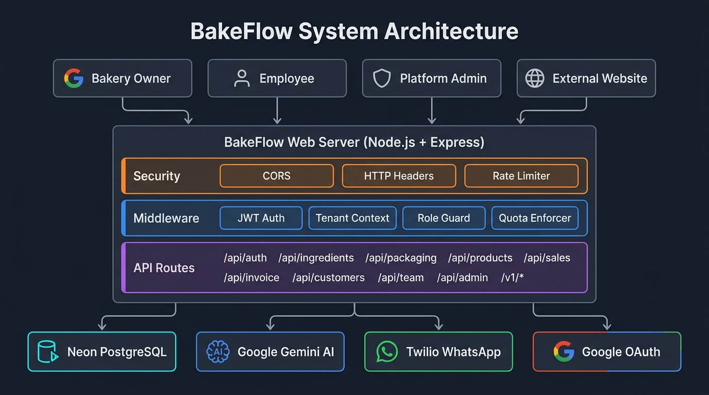
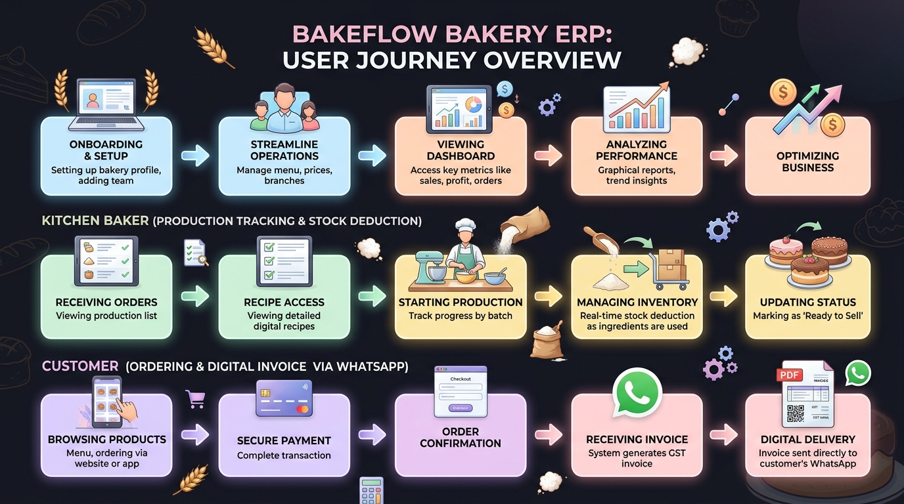
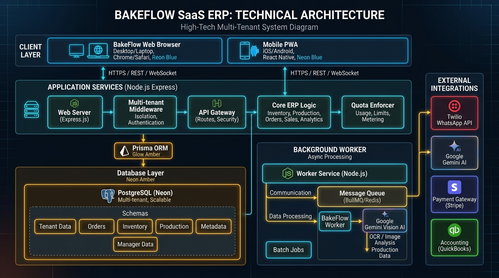
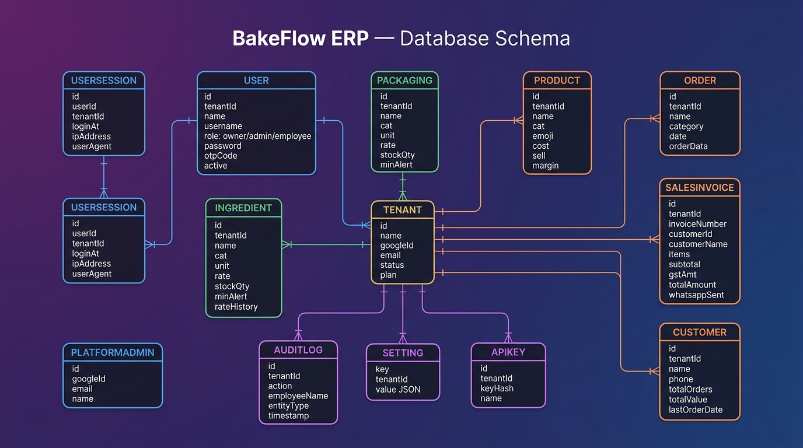

# BakeFlow ERP — Documentation Index

> **Production-ready, multi-tenant SaaS ERP for bakery businesses**
> Node.js · Express · Prisma · PostgreSQL · Google OAuth · Gemini AI · Twilio · Vanilla JS

---

## Document Index

| # | Document | Description |
|---|----------|-------------|
| 01 | [Project Overview](./01_project_overview.md) | Introduction, problem statement, goals, target users, modules, plans |
| 02 | [Architecture and Tech Stack](./02_architecture_and_tech_stack.md) | System architecture, tech stack table, multi-tenancy, auth flows, security |
| 03 | [ER Diagram](./03_er_diagram.md) | All 13 database models, relationships, Mermaid ER diagram |
| 04 | [Block Diagram](./04_block_diagram.md) | System block diagrams, module blocks, data flow for key operations |
| 05 | [API Reference](./05_api_reference.md) | Complete REST API documentation with request/response schemas |
| 06 | [Security Design](./06_security_design.md) | Auth, RBAC, tenant isolation, rate limiting, webhook signing |
| 07 | [Data Flow Diagrams](./07_data_flow_diagrams.md) | DFD Level 0/1/2 — context, processes, detailed flows |
| 08 | [Roles and Permissions](./08_roles_and_permissions.md) | Full permissions matrix for all 4 user types |
| 09 | [Deployment Guide](./09_deployment_guide.md) | Local setup, Render deployment, Google OAuth, Twilio, Gemini |
| 10 | [Module Specifications](./10_module_specifications.md) | Detailed specs for all 13 business modules |
| 11 | [File Structure](./11_file_structure.md) | Complete project directory tree with file descriptions |
| 12 | [Testing and Quality](./12_testing_and_quality.md) | Test scripts, manual checklist, known issues, future improvements |
| 13 | [User Journey Maps](./13_user_journey.md) | Persona-driven step-by-step user journeys for Owner, Employee, and Customer |

---

## Visual Architecture & Flow Diagrams

### System Architecture


### User Journey Overview


### Technical Block Diagram


### Entity Relationship Diagram


## Quick Reference

### System at a Glance
- **13 database models** in PostgreSQL (Neon serverless)
- **15 API route modules** in Express.js
- **4 middleware layers** (auth, tenant context, role guard, quota enforcer)
- **4 user roles** (owner, admin, employee, platform_admin)
- **3 subscription plans** (free, starter, pro)
- **2 external messaging services** (Google Gemini AI, Twilio WhatsApp)
- **0 frontend frameworks** (pure Vanilla JS + HTML + CSS)

### Core Business Flow
```
Supplier Invoice → AI Scanner (Gemini) → Ingredient Inventory
                                              │
                                              ▼
                                         Product Costing
                                              │
                                              ▼
Customer Order → GST Invoice Creation → WhatsApp Delivery (Twilio)
                        │
                        ▼
                   CRM Update (customer stats self-heal)
                        │
                        ▼
                   Audit Log Entry (immutable trail)
```

### Multi-Tenancy in One Diagram
```
Tenant A ──┐
            ├── Same database, same schema
Tenant B ──┤   Data isolated by tenantId
            │   Prisma query extension auto-scopes ALL queries
Tenant C ──┘   Cross-tenant access: architecturally impossible
```

---

*Generated: September 2026*
*BakeFlow ERP v2.0.0*
